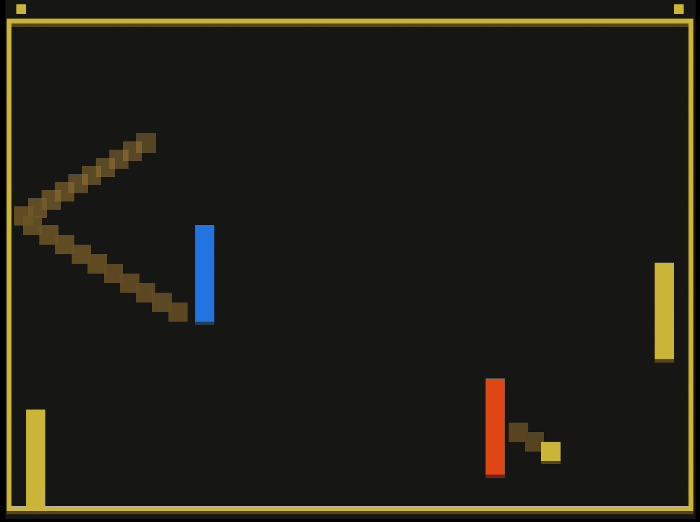

# Pongtal

Author: Xiaoqiao Xu

Design: "Portal" (teleport) mechanism is added to Pong! Two moving portals (red and blue)
are added to the game. When the ball hit one of the portals, it's teleported to
the other portal.

Screen Shot:

How To Play:

Move the left paddle with the mouse. Avoid the ball hitting left border, and
try to make it hit right border. Try to hit the ball into portals, adding more unpredictability for your opponent.

This game was built with [NEST](NEST.md).
